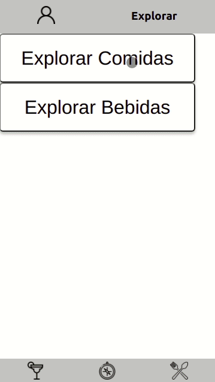

<h1>🌭 Recipes APP 🍸</h1>

<h2>Índice</h2>
<h4>- <a href="#context">Contexto</a></h4>
<h4>- <a href="#tecnologies">Técnologias utilizadas</a></h4>
<h4>- <a href="#development">Desenvolvimento</a></h4>
<h4>- <a href="#howtouse">Como executar o projeto</a></h4>

<h2 id="context">Contexto</h2>

O Recipes App foi criado para ser um aplicativo de receitas de comida e drinks, com diversas funcionalidades diferentes.

Este projeto foi realizado durante o curso da Trybe, com seu objetivo fixar todos os conteúdos estudados durante o módulo de front-end, foi realizado em grupo, para reforçar simularmos o dia-a-dia de trabalho em uma empresa.

Este projeto foi realizado em novembro de 2021, no módulo de Front-end.

As pessoas realizadoras deste projeto são:

- Bel Albuquerque (<link>https://github.com/Bel-Albuquerque</link>),

- Elithon Silva (<link>https://github.com/oelithon</link>),

- Enzo Almeida (<link>https://github.com/EnzoThome-et</link>),

- Gustavo Pozzan Dalmoro (<link>https://github.com/gustavo-pd</link>) e

- Theo Lima (<link>https://github.com/theolima14b</link>).

 

As APIs utilizada para obter as receitas foram: 

- Meals(comidas): <link>https://www.themealdb.com/api.php</link>

- Cocktails(bebidas): <link>https://www.thecocktaildb.com/api.php</link>

<h2 id="tecnologies">Técnologias utilizadas</h2>

<ul>
  <li>ReactJS</li>
  <li>React Hooks</li>
  <li>Context API</li>
  <li>Metodologias ágeis - Kanban</li>
  <li>Testes unitários - React testing library</li>
</ul>

<h2 id="development">Desenvolvimento</h2>

Neste projeto pude implementar toda página de <b>Explorar</b>da aplicação, e também as páginas dentro dela, e as funcionalidades das mesmas.

./src/pages/ <i>ExploreDrinks.jsx, ExploreFood.jsx, Explore.jsx, FoodsByIngredients,jsx, FoodsByOrigin.jsx</i> e também FoodRecipes.jsx e DrinkRecipes.jsx

Nas outras páginas pude contribuir com meus colegas de grupo e também fazer code reviews.

No desenvolvimento do projeto eram feitas duas meetings diárias, para definir as jobs de cada um e visualizar como estava o progresso do site.

Utilizamos o Trello para organização, aplicando a metodologia ágil Kanban.

Na aplicação desenvolvida é possível ver, buscar, filtrar, favoritar e acompanhar o progresso de preparação de receitas e drinks!

<h2 id="howtouse">Como executar o projeto</h2>

  1. Clone o repositório
    * `git clone https://github.com/gustavo-pd/project-trybe-futebol-clube.git`.
    * Entre na pasta do repositório que você acabou de clonar:
      * `cd project-trybe-futebol-clube`
 

  2. Instale as dependências:
    * `npm install`
 

  3. Rode o Docker para unir e subir todas as partes:
    * `npm run compose:up` para upar ou `npm run compose:down` para derrubar
 

  4. O front-end irá rodar na porta 3000, e o back-end na porta 3001, para acessar o front-end, acesse no seu navegador:
  * front-end: `http://localhost:3000`
  ou
  * back-end: `http://localhost:3001`
 

  5. Para fazer login com o admin e poder gerenciar partidas:
  * Login: `admin@admin.com` Password: `secret_admin`
 

  Para fazer login como usuário:
  * Login: `user@user.com` Password: `secret_user`
 
 
 
  

Na sua máquina você deve ter:
 
 - Sistema Operacional Distribuição Unix
 - Node versão 16  
 - Docker
 - Docker-compose versão 1.29.2
 	

➡️ O `node` deve ter versão igual ou superior à `16.15.0 LTS`. 
	* Para instalar o nvm, [acesse esse link](https://github.com/nvm-sh/nvm#installing-and-updating);
	*Rode os comandos abaixo para instalar a versão correta de `node` e usá-la:
		* `nvm install 16 --lts`
		* `nvm use 16`
		* `nvm alias default 16` 
 

➡️ O`docker-compose` deve ter versão igual ou superior à`ˆ1.29.2`:
	* Use esse [link de referência para realizar a instalação corretamente no ubuntu](https://app.betrybe.com/course/back-end/docker/orquestrando-containers-com-docker-compose/6e8afaef-566a-47f2-9246-d3700db7a56a/conteudo/0006a231-1a10-48a2-ac82-9e03e205a231/instalacao/abe40727-6310-4ad8-bde6-fd1e919dadc0?use_case=side_bar);
	* Acesse o [link da documentação oficial com passos para desinstalar] (https://docs.docker.com/compose/install/#uninstallation) caso necessário.
